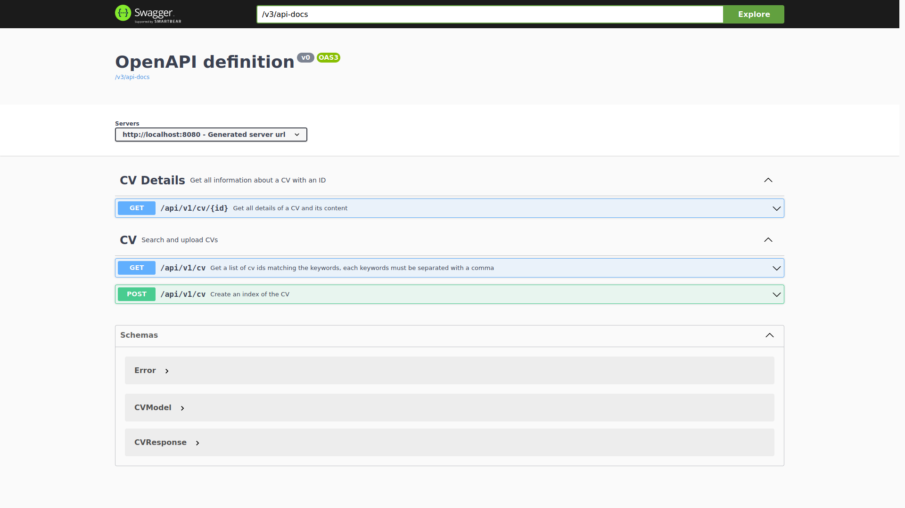
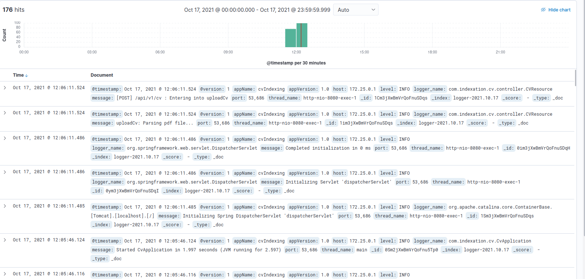

# CV Indexing
[](https://circleci.com/gh/alexandre-em/CVIndexing/tree/master)

CV Indexing is an API developed in java spring boot, with the elk stack (elasticsearch, kibana, logstash). 
It allows the user to upload then index __*.doc, *.docx and *.pdf__ CV files to elastic search and to search CVs matching
keywords.

### Group:
* **Sivacoumar Silvain**
* **Bouibker Oussama**
* **Em Alexandre**

Task division [here](https://github.com/alexandre-em/CVIndexing/projects/1)
## Installation
### Requirements
Install [Docker-compose](https://docs.docker.com/compose/install/), then pull and run elk images
```shell
    $ git checkout origin master # skip this if you're already on master and omit `origin` if master exist locally
    $ docker-compose up build elasticsearch kibana logstash # then wait until kibana is ready
```
Wait for the containers to be completely run (so kibana is ready at [localhost:5601](http://localhost:5601/)) 
Then install and run the app container:
```shell
    $ docker-compose up build app # run only if kibana is ready 
```
You could run and build all with `docker-compose up -d --build`, 
but il would generate unnecessary warning/error logs while trying to run the app multiple times.
### Run on a local environment
To run on a local environment (without docker), you will have to update some configuration files:
* [logback.xml](src/main/resources/logback.xml): line 7 update to your local logstash endpoint
* [ElasticSearchConfiguration.java](src/main/java/com/indexation/cv/repository/ElasticSearchConfiguration.java) line 18 & 19 update to your local elasticsearch endpoint and authentication information if you have configured one, delete line 19 if not

Then you can run the project app with:
```shell
    $ ./mvnw clean package
    $ java -jar ./target/cv-0.0.1-SNAPSHOT.jar
```
---
:warning: **NOTE**
Make sure to have Java installed and the JAVA_HOME environment set. :warning:
---
## Endpoints examples
### Search Cvs by keywords
```shell
    $ curl "localhost:8080/api/v1/cv?keyword=java,node" | jq
```

### Search Cv by id
```shell
    $ curl "localhost:8080/api/v1/cv/BQZt13wBU44mpGRqWCPE" | jq
```

### Index a new CV
```shell
    # Example without tags
    $ curl -X POST localhost:8080/api/v1/cv -H 'accept: application/json' -H 'Content-Type: multipart/form-data' -F 'file=@cv.pdf;type=application/pdf' | jq
    # Example with tags
    $ curl -X POST localhost:8080/api/v1/cv -H 'accept: application/json' -H 'Content-Type: multipart/form-data' -F 'file=@cv.pdf;type=application/pdf' -F "tags=java" -F "tags=node" -F "tags=python" | jq
```

### Get CV Tags by `cv_id`
```shell
    $ curl "localhost:8080/api/v1/tag/cv/JwYD2HwBU44mpGRqQ1dw" | jq
      % Total    % Received % Xferd  Average Speed   Time    Time     Time  Current
                                     Dload  Upload   Total   Spent    Left  Speed
      100   103    0   103    0     0   4120      0 --:--:-- --:--:-- --:--:--  4120
      {
        "id": "KQYD2HwBU44mpGRqRFcJ",
        "cvId": "JwYD2HwBU44mpGRqQ1dw",
        "tags": [
          "java",
          "node",
          "React",
          "Typescript"
        ]
      }
```

### Add tags to a CV
```shell
    $ curl -X PATCH "localhost:8080/api/v1/tag/cv/JwYD2HwBU44mpGRqQ1dw?tags=Spring&tags=Elasticsearch" | jq
      % Total    % Received % Xferd  Average Speed   Time    Time     Time  Current
                                       Dload  Upload   Total   Spent    Left  Speed
        100   128    0   128    0     0   1488      0 --:--:-- --:--:-- --:--:--  1505
      {
        "id": "KQYD2HwBU44mpGRqRFcJ",
        "cvId": "JwYD2HwBU44mpGRqQ1dw",
        "tags": [
          "java",
          "node",
          "React",
          "Typescript",
          "Spring",
          "Elasticsearch"
        ]
      }
```

## OpenAPI
You can also visualize how to use all endpoints with the OpenApi available at [api/apidocs.html](http://localhost:8080/apidocs.html)


## Kibana
You can access to kibana at [localhost:5601](http://localhost:5601/)
To be able to visualize the data on kibana:
```json
    {
      "username": "elastic",
      "password": "root"
    }
```


## Front-end

